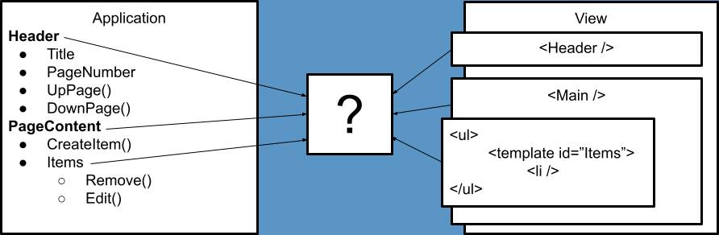

# mvw
 *minimalistic model-view embracing the DOM*

Model-View-Web

[Documentation](https://github.com/DataDink/mvw/wiki)

[Samples](https://datadink.github.io/mvw/)

**Goal:** Bridge Application & Presentation, unobtrusively & declaratively,
without deviating from or hiding existing web strategies & patterns.

**Result:** Extension to the DOM Node with a `.map(model)` function that enables
declarative, attribute-driven mapping/binding between elements and models.

**Pros:**
* Tiny
* Clean
* Declarative
* Unoppinionated
* Embraces the Web
* Targets light projects (no overhead, quick startup)

**Cons:**
* Performance: Enough for lightweight projects
* Scalability: Beyond the scope of this project
* Support: Not likely, this was an experiment.

**Problem Being Solved**
*The only real missing piece to the DOM is a good method for declaratively binding it to a model*


# Examples
## Basics
*Maps `model.value` to the span's `textContent` property*

**View**
```xml
<span data-textContent="value"></span><!-- equiv to span.textContent = model.value -->
```
**Model**
```javascript
var model = {
  value: 'Some text for content'
}
```
**Bootstrap**
```javascript
document.body.map(model);
```
**Result**
```xml
<span data-textContent="value">Some text for content</span>
```

## Handling Clicks
*Maps `model.handler` to the div's `onclick` property*

**View**
```xml
<div data-onclick="handler">click me</div><!-- equiv to div.onclick = model.handler -->
```
**Model**
```javascript
var model = {
  handler: e => alert('clicked')
}
```
**Bootstrap**
```javascript
document.body.map(model);
```

## Refreshing the DOM after an update to the model
*A button that updates a value in a span*

**View**
```xml
<span data-textContent="value"></span>
<button data-onclick="increment">Increment</button>
```
**Model**
```javascript
class Application {
  #view;
  value = 0;
  increment() {
    this.value++;
    this.refresh();
  }
  refresh() {
    // re-mapping will apply changes on the model to the DOM
    this.#view.map(this);
  }
  constructor(view) {
    this.#view = view;
    this.refresh();
  }
}
```
**Bootstrap**
```javascript
new Application(document.body);
```

## Mapping a class on an element to a boolean on a model
*The `model.value1` and `model.value2` values will determine if the divs have the `active` class or not*

**View**
```xml
<div data-class-active="value1"></div>
<div data-class-active="value2"></div>
```
**Model**
```javascript
var model = {
  value1: true,
  value2: false
};
```
**Bootstrap**
```javascript
document.body.map(model);
```
**Result**
```xml
<div class="active" data-class-active="value1"></div>
<div data-class-active="value2"></div>
```

## Mapping an attribute on an element to a boolean on a model
*The `model.value1` and `model.value2` values will determine if the inputs have the `disabled` attribute or not*

**View**
```xml
<input type="text" data-attribute-disabled="value1" />
<input type="text" data-attribute-disabled="value2" />
```
**Model**
```javascript
var model = {
  value1: true,
  value2: false
};
```
**Bootstrap**
```javascript
document.body.map(model);
```
**Result**
```xml
<input type="text" disabled="disabled" data-attribute-disabled="value1" />
<input type="text" data-attribute-disabled="value2" />
```

## Mapping a template to an array of data
*The template will populate to the DOM based on the items at `model.value`*

**View**
```xml
<ul>
  <template data-template="value">
    <li data-textContent="text"></li>
  </template>
</ul>
```
**Model**
```javascript
var model = {
  value: [
    {text: 'First Item'},
    {text: 'Second Item'},
    {text: 'Third Item'}
  ]
}
```
**Bootstrap**
```javascript
document.body.map(model);
```
**Result**
```xml
<ul>
  <template data-template="value">
    <li data-textContent="text"></li>
  </template>
  <li data-textContent="text">First Item</li>
  <li data-textContent="text">Second Item</li>
  <li data-textContent="text">Third Item</li>
</ul>
```

## Getting input from the user
*Using `FormData` to grab input from a form on submit*

**View**
```xml
<form data-onsubmit="submit">
  <input name="title" type="text" />
  <input name="description" type="text" />
  <button type="submit">Submit</button>
</form>
```
**Model**
```javascript
var model = {
  submit = e => {
    e.preventDefault();
    var data = new FormData(e.target);
    console.log(data.get('title'));
    console.log(data.get('description'));
  }
}
```
**Bootstrap**
```javascript
document.body.map(model);
```

# Version Notes
* 1.0.1
  * Improved naming
    * HTMLElement.prototype.classes -> Element.prototype.class
      * Changed to match the non-plural name change of settings to attribute
      * Less likely to become a future conflict (see (Element.prototype.className)[https://developer.mozilla.org/en-US/docs/Web/API/Element/className])
    * HTMLElement.prototype.settings -> Element.prototype.attribute
      * Changed to better reflect the extensions purpose.
* 1.0.0
  * Hello World
  * Extensions
    * Node.prototype.map
    * HTMLElement.prototype.classes
    * HTMLElement.prototype.settings
    * HTMLTemplateElement.prototype.template
  * Unit Tests: Yep
  * Performance Tests: Nope
